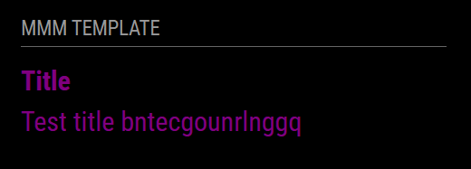

# MMM-Notification-Control
Module to receive network notifications (webhooks) and forward them into MagicMirror as notifications or display payloads.

## Screenshot



## Installation

### Install

In your terminal, go to the modules directory and clone the repository:

```bash
cd ~/MagicMirror/modules
git clone [GitHub url]
```

### Update

Go to the module directory and pull the latest changes:

```bash
cd ~/MagicMirror/modules/MMM-Notification-Control
git pull
```

## Configuration

To use this module, you have to add a configuration object to the modules array in the `config/config.js` file.

### Example configuration

Minimal configuration to use the module:

```js
    {
        module: 'MMM-Notification-Control',
        position: 'lower_third'
    },
```

Configuration with all options:

```js
    {
        module: 'MMM-Notification-Control',
        position: 'lower_third',
        config: {
            exampleContent: 'Welcome world',
                            webhook: {
                                enabled: true,
                                port: 8081,
                                path: '/mmm-webhook',
                                // List of notifications to re-emit to other modules.
                                // Empty array (default) means do not re-emit any notifications.
                                // Use ['*'] to re-emit all incoming notifications.
                                allowedNotifications: ['PAGE_TURN'],
                                secret: '' // optional
                            }
        }
    },
```

### Configuration options

Option|Possible values|Default|Description
------|------|------|-----------
`exampleContent`|`string`|not available|The content to show on the page

## Sending notifications to the module

Notification|Description
------|-----------
`TEMPLATE_RANDOM_TEXT`|Payload must contain the text that needs to be shown on this module

### Webhook usage

The helper can listen for POST JSON webhooks and forward notifications to the front-end. POST a JSON body like:

```json
{
    "notification": "PAGE_TURN",
    "payload": { "text": "Hello from webhook" }
}
```

Simple curl examples:

- No secret:

```bash
curl -X POST -H 'Content-Type: application/json' \
    -d '{"notification":"PAGE_TURN","payload":{"text":"Hello from webhook"}}' \
    http://<MM_IP>:8081/mmm-webhook
```

- With secret header:

```bash
curl -X POST -H 'Content-Type: application/json' -H 'X-Webhook-Secret: mysecret' \
    -d '{"notification":"PAGE_TURN","payload":{"text":"Secret hello"}}' \
    http://<MM_IP>:8081/mmm-webhook
```

### Port fallback and runtime info

If the requested port (default 8081) is already in use, the helper will attempt the next ports (up to a configurable number of attempts). If no ports are available in that range, it will fall back to an ephemeral port chosen by the OS.

When the helper successfully starts the webhook server it sends a socket notification to the frontend module: `WEBHOOK_STARTED` with payload `{ port: <number>, path: <string> }`. The module displays this information in its UI so you can see which port/path to call.

## Developer commands

- `npm install` - Install devDependencies like ESLint.
- `node --run lint` - Run linting and formatter checks.
- `node --run lint:fix` - Fix linting and formatter issues.

## License

This project is licensed under the MIT License - see the [LICENSE](LICENSE.md) file for details.

## Changelog

All notable changes to this project will be documented in the [CHANGELOG.md](CHANGELOG.md) file.
